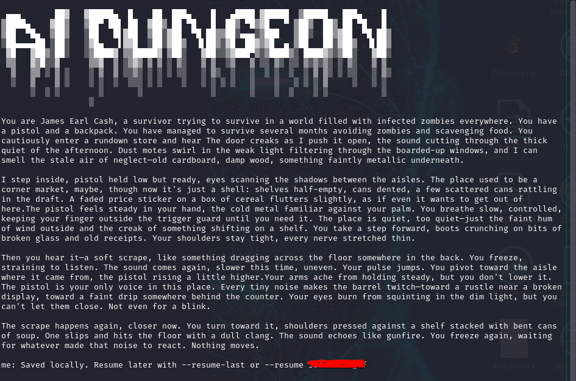

# AI Dungeon CLI Release

AI Dungeon CLI Release is a terminal-based interactive fiction client for Linux. It lets you play AI-generated adventures from the command line, keep persistent local references to saved adventures, and resume previous sessions without leaving the terminal.

## Project Origin

This project was inspired by the original `ai-dungeon-cli` created by Eigenbahn:
https://github.com/Eigenbahn/ai-dungeon-cli

That original project was an important reference for the terminal gameplay flow and overall user experience, but it no longer works with the modern AI Dungeon backend. This release was created as a new practical implementation inspired by that earlier work and its README.


## Features

- Interactive story gameplay with `/do`, `/say`, `/story`, and `/remember` actions
- Persistent save and resume support through local adventure state tracking
- Terminal-first user interface with optional slow typing mode
- Spinner-based loading feedback while the client waits for API responses
- Resume support with `--resume <id>` and `--resume-last`



## Playing

Unless specified, all user inputs are considered Do actions.

Quoted input entries are automatically interpreted as Say actions, e.g.:

> "Hey dragon! You didn't invite me to the latest BBQ party!"

Do be explicit about the action type, prefix your input with a command:

    /do
    /say
    /story
    /remember

For example, the previous Say prompt could also be written:

> /say Hey dragon! You didn't invite me to the latest BBQ party!

To quit, either press Ctrl-C, Ctrl-D or type in the special /quit command.

## Requirements

- Linux
- Python 3.10 or newer recommended
- Internet access to reach the AI Dungeon backend
- A valid Firebase web API key exported as `AIDUNGEON_FIREBASE_API_KEY`

## Project Layout

- `main.py`: main entry point
- `ai_dungeon_cli/`: application source code
- `requirements.txt`: Python runtime dependencies
- `install.sh`: local installation helper for Linux
- `RELEASE_NOTES.md`: release sanitization and packaging notes

## Installation

Clone or download the repository, then run:

```bash
chmod +x install.sh
./install.sh
```

The installer creates a local virtual environment in `./venv`, installs the required dependencies, and creates a local launcher at `./venv/bin/ai-dungeon`.

## Usage

Before starting the client, export the backend key:

```bash
export AIDUNGEON_FIREBASE_API_KEY="YOUR_FIREBASE_WEB_API_KEY"
```

Then run the game with either of the following:

```bash
source venv/bin/activate
ai-dungeon
```

or

```bash
./venv/bin/ai-dungeon
```

## Example Commands

Start a new session:

```bash
./venv/bin/ai-dungeon
```

Resume the most recent saved adventure:

```bash
./venv/bin/ai-dungeon --resume-last
```

Resume a specific adventure by short ID or adventure ID:

```bash
./venv/bin/ai-dungeon --resume OwKgw6dd61NW
./venv/bin/ai-dungeon --resume 194532449
```

Enable slow typing output:

```bash
./venv/bin/ai-dungeon --slow-typing
```

## Save and Load Notes

- Adventure metadata is stored locally in `~/.config/ai-dungeon-cli/adventures.yml`
- `--resume-last` loads the most recently saved adventure reference
- `--resume <id>` accepts either an adventure short ID or a numeric adventure ID
- The client updates the local save reference whenever a story is created or resumed

## Virtual Environment Notes

The project installs into a local virtual environment to keep your system Python clean and predictable. This avoids polluting global packages and keeps the command isolated to this project folder.

If you open a new shell, reactivate the environment before running `ai-dungeon`:

```bash
source venv/bin/activate
```

If you prefer not to activate the environment manually, use the launcher directly:

```bash
./venv/bin/ai-dungeon
```

## Uninstall

Remove the project folder and local save metadata if you no longer need them:

```bash
rm -rf venv
rm -f ~/.config/ai-dungeon-cli/adventures.yml
```

If you want to keep your saves, remove only `venv/`.

---

## Configuration — Getting AI Dungeon to Actually Connect

This section covers the practical setup needed for the client to authenticate and
reach the AI Dungeon backend, plus the most common login problem and its fix.

### 1. The Firebase Web API key

The client authenticates against Firebase Identity Toolkit using the **public**
Firebase Web API key that the AI Dungeon frontend ships in its JavaScript bundle.
This key is *public by design* — it is not a secret, not a password, and not a
session token. It only identifies the Firebase project and does not grant access
to any account on its own.

Depending on the build you run:

- **Hardcoded build:** the key is already embedded in
  `ai_dungeon_cli/impl/api/client.py` (`self.firebase_api_key = "AIza..."`). In
  this case the `AIDUNGEON_FIREBASE_API_KEY` environment variable is **not read** —
  exporting it is harmless but has no effect, and the client works as-is.
- **Env-driven build:** reads the key from `AIDUNGEON_FIREBASE_API_KEY`, so export
  it before launching:

  ```bash
  export AIDUNGEON_FIREBASE_API_KEY="YOUR_FIREBASE_WEB_API_KEY"
  ```

To check which build you have:

```bash
grep -rn "AIDUNGEON_FIREBASE_API_KEY" ai_dungeon_cli/
```

If that prints nothing, your build uses the hardcoded key and you do not need to
export anything.

### 2. The referer/origin restriction (already handled)

The Firebase key is restricted by HTTP referrer: requests without the correct
`Referer`/`Origin` header are rejected with
`Requests from referer <empty> are blocked`. The client already sets these headers
on its HTTP session, so there is nothing to configure:

```python
self.session.headers.update({
    "Content-Type": "application/json",
    "Origin": "https://play.aidungeon.com",
    "Referer": "https://play.aidungeon.com/",
})
```

If you ever hit a "referer blocked" error, it means those headers were lost — make
sure you are on an up-to-date build.

### 3. Credentials: `~/.config/ai-dungeon-cli/config.yml`

The client reads your login from a YAML config (or from CLI flags). It searches:

- `<package dir>/config.yml`
- `~/.config/ai-dungeon-cli/config.yml`

Example `~/.config/ai-dungeon-cli/config.yml`:

```yaml
email: you@example.com
password: "your-account-password"
slow_typing_effect: false
prompt: "> "
```

Notes:
- Keep it private: `chmod 600 ~/.config/ai-dungeon-cli/config.yml`.
- If the password has special characters (`: # @ ! ...`), wrap it in quotes.
- Or pass credentials at launch instead of storing them on disk:

  ```bash
  ai-dungeon --email "you@example.com" --password 'your-account-password'
  ```

### 4. Your account must have a password

This client only supports **email + password** login (`signInWithPassword`). If
your AI Dungeon account was created with **"Continue with Google / Apple /
Discord"**, it has no password and email login will never succeed. Fix it at
**play.aidungeon.com → Account / Settings → set a password**, then use that
password here.

### 5. Launch

```bash
source venv/bin/activate
ai-dungeon
```

## Troubleshooting

### `INVALID_LOGIN_CREDENTIALS`

```json
{"error": {"code": 400, "message": "INVALID_LOGIN_CREDENTIALS"}}
```

This comes straight from Firebase and means the key and referer were accepted, but
the **email/password pair was rejected**. Firebase merged the older
`EMAIL_NOT_FOUND` and `INVALID_PASSWORD` into this single generic message, so it
covers several causes:

1. **Wrong or changed password** — the most common case. If you changed your
   password on the website, `~/.config/ai-dungeon-cli/config.yml` may still hold
   the **old** one and the client keeps sending it.
   **Fix:** update the `password:` value in that file (or delete the
   `email`/`password` lines and pass them with `--email`/`--password`).
2. **Typo** — trailing spaces, caps lock, or an unquoted special character in YAML.
3. **Social-only account** — no password set (see Configuration step 4).
4. **Wrong email** — the account lives under a different address.

### Checking which sign-in methods an account has (no password needed)

To tell "wrong password" apart from "social-only account", ask Firebase which
sign-in methods exist for an email. This needs only the email and returns no
tokens:

```bash
curl -sS -X POST \
  "https://identitytoolkit.googleapis.com/v1/accounts:createAuthUri?key=YOUR_FIREBASE_WEB_API_KEY" \
  -H "Content-Type: application/json" \
  -H "Referer: https://play.aidungeon.com/" \
  -d '{"identifier":"you@example.com","continueUri":"https://play.aidungeon.com/"}'
```

- `"signinMethods":["password"]` → has a password; it is a wrong-password case.
- OAuth providers (e.g. `google.com`) or empty `signinMethods` → social account;
  set a password on the website first.

### `API key not valid`

The Firebase key is wrong or malformed. A valid key starts with `AIza` followed by
35 characters.

### Security notes

- The Firebase Web API key is **public** and safe to ship in the client.
- Your **password** and any **session/ID token** are *not* public — never paste
  them into logs, issues, or shared files. Prefer `chmod 600` on the config, or
  pass credentials via flags instead of storing them.

## Creator

Creator: Pedro W. L. Soares de Souza
LinkedIn: https://www.linkedin.com/in/pedro-ssap/
